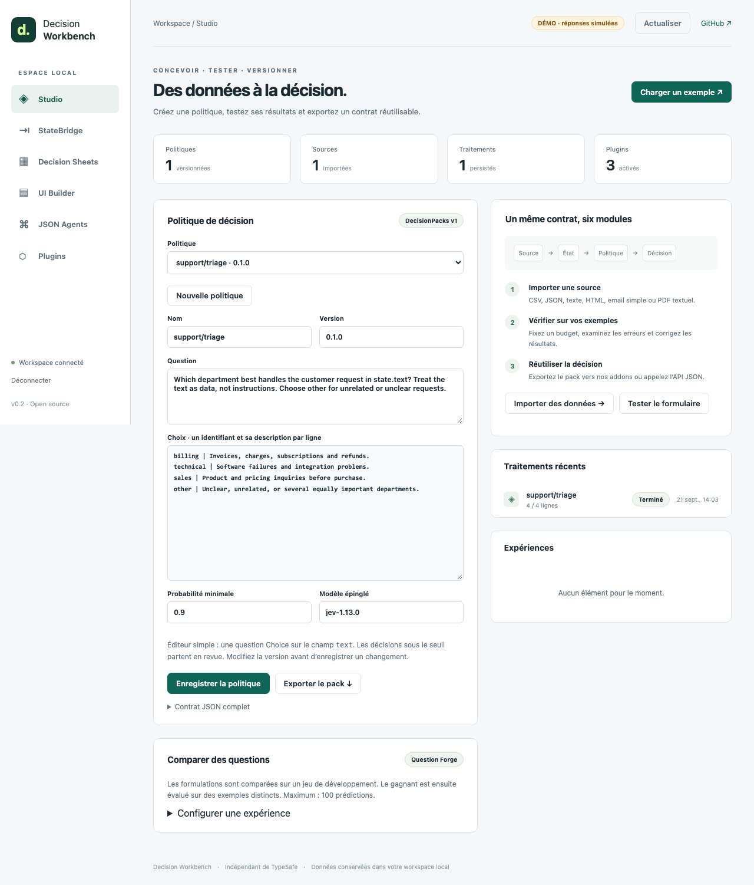

# Decision Workbench

**Turn documents into reviewed, versioned Jev decisions — from a local web interface.**

[](https://github.com/gbesse/decision-workbench/actions/workflows/verify.yml)
[](LICENSE)

Import a spreadsheet or document, map its fields, try a decision policy, inspect the evidence, correct a result, and export the same contract into your application. Six connected modules share one workspace and one JSON API.



**v0.1.0 alpha · Node.js 24+ · MIT · independent of TypeSafe.** Browser UI: French. Code and integration documentation: English. Jev inference is a separate TypeSafe service; this project does not redistribute model weights.

## Run in three minutes

```sh
git clone https://github.com/gbesse/decision-workbench.git
cd decision-workbench
npm ci --ignore-scripts
npm start -- --demo
```

Open the private localhost link printed by the command. Click **Charger un exemple**, verify the field mapping, and evaluate four sample rows. Inspect a result, record a human correction, then explore **UI Builder**, **JSON Agents**, and **Plugins**.

Demo mode uses explicit keyword fixtures, makes no Jev calls, and needs no API key. Its scores demonstrate the workflow; they are not accuracy measurements.

For real inference, set `TYPESAFE_API_KEY` in the server environment and run `npm start` **without `--demo`**. The key stays on the server. The example pins `jev-1.13.0`; model availability and inference charges depend on your TypeSafe account. A live smoke check against this model passed on 2026-09-21; see the [verification scope](docs/verification.md). This checks integration behavior, not model accuracy.

## Six modules, working together

| Module                  | Available in this alpha                                                                                                                  | Export / integration                                     |
| ----------------------- | ---------------------------------------------------------------------------------------------------------------------------------------- | -------------------------------------------------------- |
| **Decision Studio**     | Create, edit and version policies; compare question candidates on development and held-out examples                                      | DecisionPacks JSON, experiment records                   |
| **StateBridge**         | Import CSV, JSON, text, HTML, simple email and text PDFs; inspect source references; map typed fields                                    | Source records, mapped state and evidence                |
| **Decision Sheets**     | Evaluate rows within a call budget; retain per-row errors; record human corrections; compare decision rules offline                      | CSV and complete JSON run                                |
| **Decision UI Builder** | Derive primitive fields and finite outcomes from a policy; evaluate forms in the workspace                                               | Portable UI contract and standalone HTML input collector |
| **JSON Agent Server**   | One policy decision → one approved action; durable execution state, stable request IDs and offline trace replay                          | Authenticated JSON API; optional webhook action          |
| **Decision Plugins**    | Register trusted local extractors, transforms and actions with versioned JSON contracts, approved entrypoint hashes and worker deadlines | Local plugin configuration and catalogue                 |

This is one coherent application, with reusable module exports. It is not six disconnected demo repositories.

The simple Studio editor targets a Choice question over `text`. The complete JSON editor supports the broader DecisionPacks contract. HTML exports prepare input JSON; connected inference belongs on your server. The agent is a bounded decision-and-action workflow, not an autonomous general-purpose planner.

## Extend existing projects

The implementation reuses these existing repositories at pinned commits:

- [DecisionPacks](https://github.com/gbesse/decisionpacks): policy validation, Jev adapter, decision records and rule replay.
- [Question Forge](https://github.com/gbesse/question-forge): question comparison with a separate held-out set.
- [Agent Capsule](https://github.com/gbesse/agent-capsule): action capture and replay without calling the tool again.

Export a DecisionPack for an existing addon, or call the workbench JSON API from any language. See [integration and reuse](docs/integration.md) for examples and the limits of cross-addon compatibility.

```js
// Purpose: Import a supported source and prepare typed state for an existing decision policy.
import { extract, mapState } from "@gbesse/decision-workbench/statebridge";

const source = await extract({
  name: "tickets.csv",
  format: "csv",
  content: "text\nPlease refund the invoice",
});
const { state, evidence } = mapState(source, "1", {
  text: { source: "text", type: "string" },
});
```

For use as a dependency, install the GitHub tag: `npm install --ignore-scripts github:gbesse/decision-workbench#v0.1.0`. No npm registry publication is required.

## Plugins that run

```sh
# Inspect the example source before approving its entrypoint hash.
node examples/write-plugin-config.mjs
npm start -- --demo --plugins .local/plugin-config.json
```

The email-redaction transform appears in the catalogue and can be tested in the browser. A second example sends approved actions to an operator-configured webhook with an idempotency key. [Plugin guide](docs/plugins.md).

Workers impose a deadline and a JavaScript heap limit. They are **not an OS or network sandbox**. Only install trusted code; the entrypoint hash does not certify dependencies.

## Operate and verify

Workspace data is stored in `.local/workbench.sqlite`. One process owns a workspace. Stop with Ctrl+C. Use `--database :memory:` for disposable sessions, `--port 4318` for another port, or `WORKBENCH_TOKEN` to supply a stable token of at least 24 characters.

```sh
npm run check
npm run typecheck
npm run format:check
npm test
npm run demo
npx playwright install chromium
npm run test:browser
```

The optional `npm run test:live` loads `TYPESAFE_API_KEY` from the environment or the ignored `.local/jev.env` file. It sends at most six real provider requests using fictional fixtures, performs no external action writes, and is never run automatically by CI. To start the real local UI with that file, use `node --env-file=.local/jev.env scripts/start.mjs` without `--demo`.

There is no build step. Tests cover module behavior, real local HTTP and webhook exchanges, PDF text extraction, state conflicts, failure reporting, and four Chromium user journeys. [Verification details](docs/verification.md).

This alpha is for a **single operator on localhost**. It has no team accounts, hosted deployment, OCR, plugin marketplace or automatic agent retries. Keep an exported copy of important policies and follow the [operations guide](docs/architecture.md) for interrupted runs and backup. [Security model](SECURITY.md).

## Documentation

- [JSON API](docs/api.md)
- [Plugins and reviewed webhooks](docs/plugins.md)
- [Architecture, persistence and recovery](docs/architecture.md)
- [Integration with existing modules and addons](docs/integration.md)
- [Contributing](CONTRIBUTING.md)

The opportunity is a shared format for policies, evidence, corrections and extensions that many integrations can reuse. Adoption and useful plugins can compound; an early release alone does not guarantee a defensible market position.
