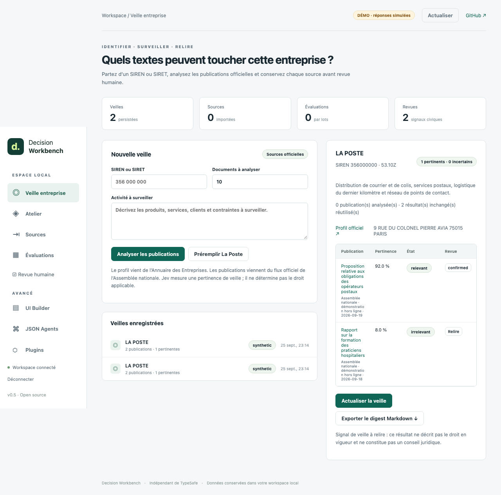

# Decision Workbench

**From a sourced document to a reviewed, exportable Jev decision.**

[](https://github.com/gbesse/decision-workbench/actions/workflows/verify.yml)
[](LICENSE)

Decision Workbench is a local product for importing evidence, evaluating a versioned decision, preserving the model
output, recording a separate human review and exporting the result. Its first complete vertical workflow monitors
French public information for a company identified by SIREN or SIRET.



**v0.5.0 · Node.js 24+ · MIT · independent of TypeSafe.** The browser UI is French. Jev inference is a separate paid
TypeSafe service; this project does not redistribute model weights.

## Try the complete product offline

```sh
git clone https://github.com/gbesse/decision-workbench.git
cd decision-workbench
npm ci --ignore-scripts
npm start -- --demo
```

Open the private localhost link, choose **Préremplir La Poste**, then **Analyser les publications**. The offline example
resolves a company profile, evaluates two sourced fixtures, lets you confirm or dismiss a signal and exports a Markdown
digest. It makes no network or Jev call and is not an accuracy demonstration.

For the real workflow:

```sh
TYPESAFE_API_KEY=... npm start
```

The server fetches the public company profile and official Assembly feed, then makes one paid Jev request per selected
new or changed publication. An incremental refresh reuses unchanged judgments and their human reviews, so it makes no
paid call when the feed window is unchanged. The key stays server-side. Each scan is limited to 20 documents and every
source call has a deadline.

## One workflow, two entries

| Stage    | Company watch                                     | Your own documents                             |
| -------- | ------------------------------------------------- | ---------------------------------------------- |
| Source   | Annuaire des Entreprises + Assemblée nationale    | CSV, JSON, text, HTML, email or textual PDF    |
| State    | Company profile + declared activity + publication | Explicit field mapping with evidence pointers  |
| Decision | Relevance signal through `jev-hemicycle`          | Versioned DecisionPack                         |
| Review   | Confirm, dismiss or keep pending                  | Correct a row without overwriting model output |
| Export   | Evidence-linked Markdown digest                   | CSV, JSON, DecisionPack or evaluation dataset  |

This is the product spine. Policy authoring, question comparison, generated forms, reviewed JSON actions and trusted
plugins remain available as advanced tools, but they all serve the same source → decision → review → export lifecycle.

## Existing projects reused directly

- [Jev Hémicycle](https://github.com/gbesse/jev-hemicycle) normalizes and evaluates parliamentary publications.
- [DecisionPacks](https://github.com/gbesse/decisionpacks) validates policies, calls Jev and replays decision rules.
- [Question Forge](https://github.com/gbesse/question-forge) compares wording on development and held-out examples.
- [Agent Capsule](https://github.com/gbesse/agent-capsule) captures approved actions for tool-free replay.

Pinned Git commits in `package.json` make the reused implementation auditable. The Workbench adds source ingestion,
persistence, authentication, browser workflows and human review rather than copying these repositories.

## Generic document workflow

Switch to **Atelier** to edit a policy, **Sources** to import evidence, then **Évaluations** to map fields and run a
bounded batch. Corrections remain separate from the original judgment. Decision Review can require multiple votes and
an adjudication before exporting development or holdout cases.

```js
import { extract, mapState } from "@gbesse/decision-workbench/statebridge";

const source = await extract({
  name: "tickets.csv",
  format: "csv",
  content: "text\nPlease refund the invoice",
});
const { state, evidence } = mapState(source, "1", {
  text: { source: "text", type: "string" },
});
```

Importable modules include `./civic`, `./statebridge`, `./review`, `./sheets`, `./ui`, `./agent`, `./plugins`, `./apps`
and `./storage`. Install the tagged repository with
`npm install --ignore-scripts github:gbesse/decision-workbench#v0.5.0`.

## Operate and verify

Workspace data is stored in `.local/workbench.sqlite`. One process owns a workspace. The server binds to loopback,
requires a local bearer token and rejects foreign browser origins. Stop with Ctrl+C; use `--database :memory:` for a
disposable session or `--port 4318` for another port.

```sh
npm run format:check
npm run check
npm run typecheck
npm test
npm run demo
npx playwright install chromium
npm run test:browser
```

`npm run test:live` makes at most six paid Jev calls using fictional generic examples. `npm run test:civic:live`
resolves a real public profile, fetches the live Assembly feed and makes exactly three paid calls. Neither runs in CI.

There is no build step. Default verification covers 39 module/API tests and eight Chromium journeys. This remains a
single-operator localhost application: no accounts, hosted deployment, OCR, scheduler, automatic email or legal advice.

## Documentation

- [Company public watch](docs/civic-watch.md)
- [Verification scope](docs/verification.md)
- [JSON API](docs/api.md)
- [Architecture, persistence and recovery](docs/architecture.md)
- [Integration and reusable modules](docs/integration.md)
- [Editable forms and reviewed action sequences](docs/forms-and-sequences.md)
- [Trusted plugins and reviewed webhooks](docs/plugins.md)
- [Security model](SECURITY.md)
