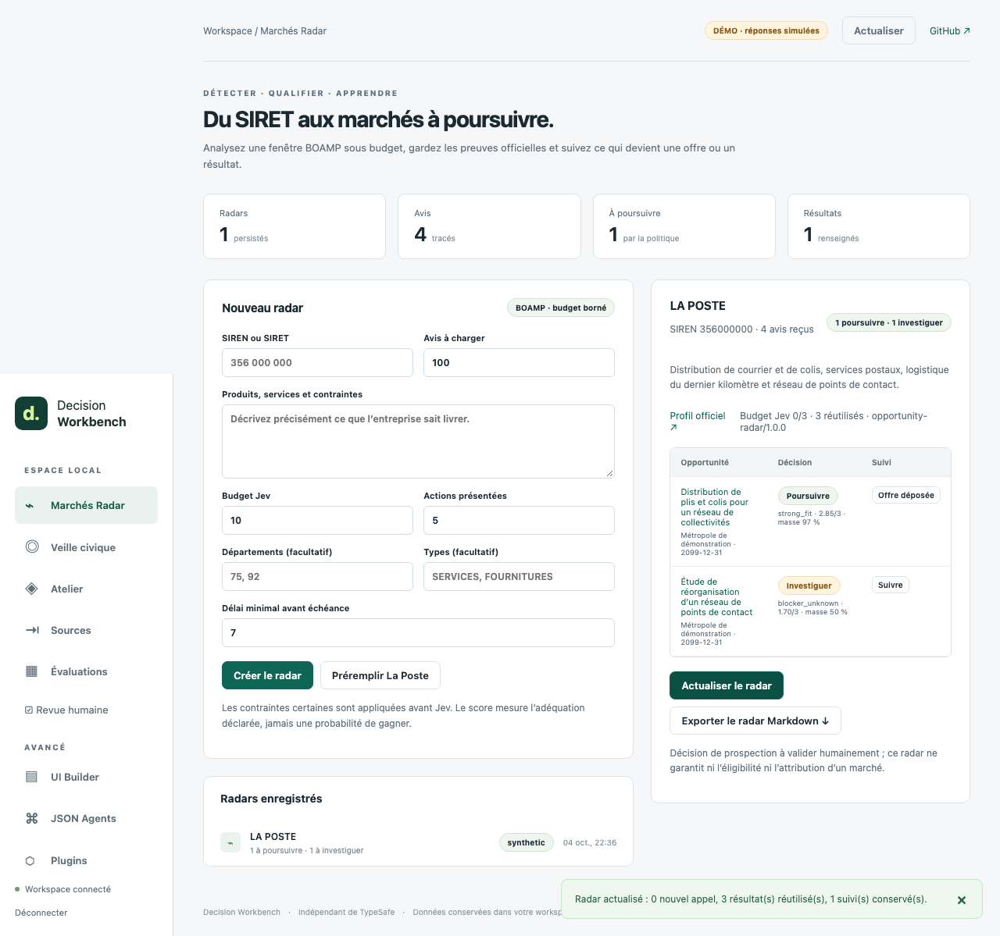

# Decision Workbench

**Du SIRET à cinq marchés publics réellement actionnables.**

[](https://github.com/gbesse/decision-workbench/actions/workflows/verify.yml)
[](LICENSE)

Decision Workbench is the local, open-source home of **Marchés Radar**. Starting from a French SIREN or SIRET, it loads
a bounded BOAMP window, applies deterministic commercial constraints before inference, and produces an evidence-linked
`pursue` / `investigate` / `ignore` inbox. Operator outcomes remain separate from Jev output and close the loop from
qualification to bid, win, loss or dismissal.



**v0.9.2 · Node.js 24+ · MIT · independent of TypeSafe.** The browser UI is French. Jev inference is a separate paid
TypeSafe service; this project does not redistribute model weights.

## Try the complete product offline

`node examples/radar-shortlist.mjs` filters a two-signal synthetic watch to relevant items and checks their source links. / `node examples/radar-shortlist.mjs` filtre deux signaux synthétiques pour ne garder que les éléments pertinents et vérifie leurs liens source. / `node examples/radar-shortlist.mjs` filtra dos señales sintéticas para conservar solo los elementos relevantes y comprueba sus enlaces de origen. It makes no BOAMP or Jev call. / Aucun appel BOAMP ou Jev. / No realiza llamadas a BOAMP ni a Jev.

```sh
git clone https://github.com/gbesse/decision-workbench.git
cd decision-workbench
npm ci --ignore-scripts
npm start -- --demo
```

Open the private localhost link, choose **Préremplir La Poste**, then **Créer le radar**. The offline example resolves a
company profile, evaluates four explicit BOAMP fixtures, lets you record the commercial outcome and exports a Markdown
brief. It makes no network or Jev call and is not an accuracy demonstration.

The same complete product path is available without the browser:

```sh
./scripts/cli.mjs radar --demo
# Live after setting TYPESAFE_API_KEY:
./scripts/cli.mjs radar --siret 356000000 \
  --activity "Services postaux, colis et logistique du dernier kilomètre" \
  --limit 20 --max-calls 10 --max-results 5 \
  --departments 75,92 --contract-types SERVICES
```

The installed command names are `decision-workbench` and `jev-france`, so the live form is also
`jev-france radar --siret …`. Markdown is written to stdout by default; `--format json` and `--output` support
machine-readable runs. Output files are created with mode 600 and are not silently overwritten.

The broader civic watch remains available under **Veille civique** and through `jev-france impact`. Multi-company
monitoring remains available with `jev-france portfolio`; these workflows are now secondary to the opportunity inbox.

For several companies, use one manifest and one global worst-case budget:

```sh
jev-france portfolio --demo --input examples/civic-portfolio.json --max-calls 6
# Remove --demo for official sources and Jev; add --checkpoint .local/portfolio.json for incremental runs.
```

Every company declares its own `maxDocuments`, while `--max-calls` caps their sum before any source or provider call.
The JSON or Markdown result aggregates usage and retains each complete evidence-linked watch.

For the real workflow:

```sh
TYPESAFE_API_KEY=... npm start
```

The server fetches the public company profile and current BOAMP procurement notices, then applies deadline, lead-time,
CPV, geography, contract-type, buyer and amount gates before any paid request. A deterministic candidate ranker spends
the capped budget on the closest eligible notices; unevaluated notices remain counted but never fill the action list.
An unchanged refresh reuses source-fingerprinted assessments and commercial outcomes without another paid call. A
failed provider call becomes an explicit investigation instead of aborting the batch. The key stays server-side;
sources and decisions remain in the local SQLite workspace.

## Un résumé de veille prêt à partager · A concise watch brief · Un resumen de vigilancia

`npm run demo:brief` produit un JSON court à partir des mêmes sources et décisions **synthétiques** que la démonstration civique. Il conserve le nombre de signaux et les liens de source, pour illustrer ce qu'une intégration pourrait afficher. Ce n'est ni une veille réelle ni une mesure de qualité.

`npm run demo:brief` produces compact JSON from the same **synthetic** civic sources and decisions. It keeps signal counts and source links to show what an integration could display. It is neither a live watch nor a quality measurement.

`npm run demo:brief` genera un JSON breve a partir de las mismas fuentes y decisiones cívicas **sintéticas**. Conserva los recuentos y enlaces de origen para mostrar lo que podría presentar una integración. No es una vigilancia real ni una medición de calidad.

## One spine, three entries

| Stage    | Marchés Radar                          | Civic watch                       | Your own documents                             |
| -------- | -------------------------------------- | --------------------------------- | ---------------------------------------------- |
| Source   | Annuaire + BOAMP                       | Annuaire + Parliament + BOAMP     | CSV, JSON, text, HTML, email or textual PDF    |
| State    | Capabilities + hard constraints        | Company + declared activity       | Explicit field mapping with evidence pointers  |
| Decision | Pursue / investigate / ignore          | Relevant / irrelevant / uncertain | Versioned DecisionPack                         |
| Review   | Qualified / bid / won / lost / dismiss | Confirm / dismiss / pending       | Correct a row without overwriting model output |
| Export   | Evidence-linked opportunity brief      | Evidence-linked watch digest      | CSV, JSON, DecisionPack or evaluation dataset  |

This is the product spine. The Atelier includes the direct Postman-like gesture: paste a JSON state, choose a
DecisionPack, run one evaluation and inspect the unchanged probabilities and decision trace. Recent trials persist
across reloads and can be reopened or exported. Policy authoring,
question comparison, generated forms, reviewed JSON actions and trusted plugins remain available as advanced tools,
but they all serve the same source → decision → review → export lifecycle.

## Existing projects reused directly

- [Jev Hémicycle](https://github.com/gbesse/jev-hemicycle) normalizes and evaluates parliamentary publications.
- [Jev Marchés](https://github.com/gbesse/jev-marches) fetches and evaluates official BOAMP procurement notices.
- [DecisionPacks](https://github.com/gbesse/decisionpacks) validates policies, calls Jev and replays decision rules.
- [Question Forge](https://github.com/gbesse/question-forge) compares wording on development and held-out examples.
- [Agent Capsule](https://github.com/gbesse/agent-capsule) captures approved actions for tool-free replay.

Pinned Git commits in `package.json` make the reused implementation auditable. The Workbench adds source ingestion,
persistence, authentication, browser workflows and human review rather than copying these repositories.

## Generic document workflow

Switch to **Atelier** to edit a policy, **Sources** to import evidence, then **Évaluations** to map fields and run a
bounded batch. Corrections remain separate from the original judgment. Decision Review can require multiple votes and
an adjudication before exporting development or holdout cases.

```js
import { extract, mapState } from "@gbesse/decision-workbench/statebridge";

const source = await extract({
  name: "tickets.csv",
  format: "csv",
  content: "text\nPlease refund the invoice",
});
const { state, evidence } = mapState(source, "1", {
  text: { source: "text", type: "string" },
});
```

Importable modules include `./radar`, `./civic`, `./statebridge`, `./review`, `./sheets`, `./ui`, `./agent`, `./plugins`, `./apps`
and `./storage`. Install the tagged repository with
`npm install --ignore-scripts github:gbesse/decision-workbench#v0.9.2`.

## Operate and verify

Workspace data is stored in `.local/workbench.sqlite`. One process owns a workspace. The server binds to loopback,
requires a local bearer token and rejects foreign browser origins. Stop with Ctrl+C; use `--database :memory:` for a
disposable session or `--port 4318` for another port.

```sh
npm run format:check
npm run check
npm run typecheck
npm test
npm run demo
npx playwright install chromium
npm run test:browser
```

`npm run test:live` makes at most six paid Jev calls using fictional generic examples. `npm run test:civic:live`
resolves a real public profile, fetches the live Assembly feed and makes exactly three paid calls. Neither runs in CI.

There is no build step. Default verification covers the module/API suite and Chromium journeys. This remains a
single-operator localhost application: no accounts, hosted deployment, OCR, scheduler, automatic email or legal advice.

## Documentation

- [Marchés Radar](docs/market-radar.md)
- [Company public watch](docs/civic-watch.md)
- [Verification scope](docs/verification.md)
- [JSON API](docs/api.md)
- [Architecture, persistence and recovery](docs/architecture.md)
- [Integration and reusable modules](docs/integration.md)
- [Editable forms and reviewed action sequences](docs/forms-and-sequences.md)
- [Trusted plugins and reviewed webhooks](docs/plugins.md)
- [Security model](SECURITY.md)

## October 2026 improvement · Amélioration d’octobre 2026 · Mejora de octubre de 2026

Run `npm run demo:radar-refresh` to see a synthetic BOAMP radar refresh reuse three unchanged assessments, make zero new model calls and retain a human bid outcome.

Exécutez `npm run demo:radar-refresh` pour voir un rafraîchissement BOAMP synthétique réutiliser trois évaluations inchangées, sans nouvel appel au modèle, et conserver une décision humaine de candidature.

Ejecute `npm run demo:radar-refresh` para ver cómo una actualización BOAMP sintética reutiliza tres evaluaciones intactas, sin nuevas llamadas al modelo, y conserva una decisión humana de licitar.

## Contrôle d’adoption · Adoption check · Comprobación de adopción

[Français : essayer un cas concret](examples/adoption-check.md) · [English: try a concrete case](examples/adoption-check.md) · [Español: pruebe un caso concreto](examples/adoption-check.md).
