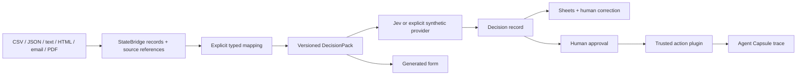

# Architecture and operations

This document describes the alpha's execution boundaries, stored data and recovery behavior.

## Responsibilities

`packages/studio` serves static browser assets and the authenticated API. `statebridge`, `sheets`, `ui`, `agent` and `plugins` expose independent ESM entrypoints. `core` owns JSON validation, deadlines, a SQLite object store, and the workspace lease. The browser uses the API rather than importing server code.

A DecisionPack carries its own model pin, input types, questions, rules and fallback. The workspace wraps each object with `{id, revision, updated, data}`. Writes compare the expected revision in a SQLite transaction; stale edits receive HTTP 409. Semantic policy versions cannot be rebound to different content. Jobs snapshot their policy and mapping when they start.

A model failure is recorded as an error, not silently converted into the policy's review outcome. Human corrections remain alongside the original judgment. Rule replay reuses recorded answers and requires compatible questions and model; changed questions require fresh inference.

## Persistence

SQLite uses WAL and a five-second busy timeout. Object writes append a corresponding event in the same transaction. Review events preserve correction history. Events are append-only through this API, but are not a signed or tamper-proof audit log.

The database contains imported fields, source hashes, evidence references, states, judgments, corrections, plugin outputs and action traces in plaintext. The original binary document is not retained. Source references identify locations in the original source; retain that source separately when you need later verification. These references do not prove the truth of a model answer.

New workspace directories use mode 0700; existing directory permissions are not changed. Protect the parent directory. Back up the database after a clean shutdown, or use a SQLite-aware backup procedure including WAL consistency. Retention and deletion are the operator's responsibility in this alpha.

## Limits

- One workspace server, up to eight concurrent API handlers, two active batches.
- Sources: 3 MB, 500 records, 100 KB per record; structured imports have at most 50 fields. PDFs: at most 40 pages.
- Batch: up to 100 selected rows with an explicit maximum-call budget; sequential provider requests.
- Experiments: at most 100 predictions and a 90-second overall deadline.
- Default provider call deadline: 30 seconds. Extraction worker: 20 seconds. Interactive plugin test: 10 seconds.
- Plugin execution: at most 60 seconds, 128 MB old-generation JS heap; 5 MB JSON input and 6 MB JSON output. The heap cap is not a total process memory cap.
- HTTP JSON bodies: 5 MB. Stored object: 8 MB. Oversized combined job state fails visibly; chunk large workloads.

Text PDFs are supported. Scanned PDFs require an external OCR implementation. Email parsing supports plain RFC822 bodies, not multipart attachments or MIME encodings. Mapping converts explicit primitive fields; it does not infer missing facts or silently stringify nested objects.

## Interrupted work

A `.lock` file adjacent to the database prevents another server from owning it. A clean shutdown removes this lease. After a crash, inspect the file's host and PID and confirm the previous process is no longer running before manually removing the stale lock.

On restart, unfinished jobs and evaluations become `interrupted`; actions claimed as `executing` become `uncertain`. Nothing automatically repeats an external action. Inspect the remote system and saved trace before issuing a new request. The webhook example sends a stable idempotency key, but the receiver must implement deduplication. This is not an exactly-once delivery guarantee.

Cancellation aborts remaining batch work and keeps saved rows. Approved action replay uses its per-step capsules and does not invoke plugins again. Routes can contain up to ten actions, each separately approved; see [forms and sequences](forms-and-sequences.md). A failed action can be marked uncertain even when the failure happened before a side effect; that conservative status requires inspection.

## Errors and embedding

The standalone server writes unexpected errors to stderr and an SQLite `error` event. Batch row errors and captured action failures use the same reporter. The UI presents API failures and stored failure states. An embedding application can supply `onError(error)` to connect its existing alert reporter; the callback should return promptly and handle its own asynchronous delivery failures. No email service or administrator recipient is configured by this repository.

Direct SDK calls reject or return explicit failed rows. Applications embedding these modules own their error reporting, authentication and durable storage policy.
